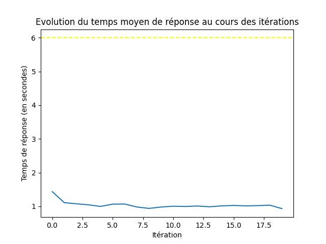
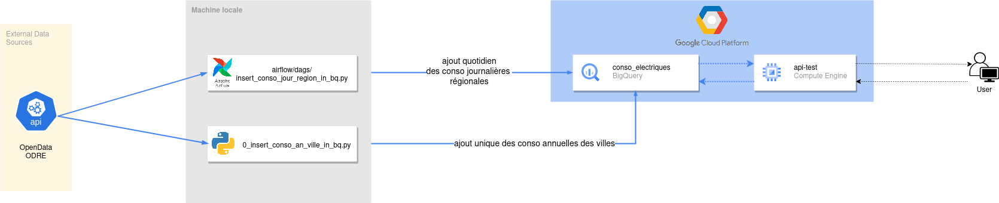

<h2 align="center">Tarification électrique basée sur la consommation</h2>

<div align="center"></div>

<h2 align="center">François Legland</h2>

## À propos du projet

### Description

Une entreprise fournisseuse d'énergie souhaite acquérir de nouveaux clients depuis son site Internet.

Pour cela, l'entreprise cherche à proposer un formulaire gratuit en ligne permettant à chaque utilisateur visitant le site Web d'évaluer rapidement et simplement sa consommation.

* La consommation électrique moyenne de la région au cours des 30 derniers jours.
* La consommation moyenne annuelle dans la ville de résidence de l'utilisateur.
* Le tarif réglementé du kWh (actuellement à 0,1558€).
* La superficie du logement (appartement ou maison) en m2.
* Les usages de l’électricité (chauffage, eau chaude, cuisson).
* Le nombre de personnes (minimum 1, maximum 10).

Les champs du formulaire permettent de calculer le modèle de tarification suivant.

$$\text{Prix}=(0.1558 + \alpha M) x +C$$

Les détails de la formule de tarification se trouvent dans la [notice technique](./docs/Notice%20technique.htm).

### Contraintes

* Le temps de calcul de chaque estimation doit être inférieur à 6 secondes.
* Les coûts générés par l'utilisation du formulaire doivent être inférieurs à 20€ / 1000 estimations.
* Les coûts de stockage et d'exécution sur le Cloud doivent être inférieurs à 100€ HT par mois.

## Étapes de réalisation du projets

### 0. Clôner le dépôt git

```shell
git clone https://github.com/FrancLgd/Tarification_elec.git
cd Tarification_elec
```

### 1. S'authentifier à la Sandbox GCP

Les commandes qui suivent permettent d'installer gcloud CLI.

```shell
sudo snap install google-cloud-cli
```

On exécute ensuite les commandes ci-dessous en pensant à spécifier les bonnes valeurs de `GCP_MAIL`, `GCP_PROJECT_ID` et `GCP_USER`. Dans la fenêtre navigateur nouvellement ouverte, on s'authentifie avec les accès fournis de la Sandbox. On pense par ailleurs à modifier en parallèle les informations liées au compte dans le fichier `config.cfg`.

```shell
export GCP_MAIL=sandbox-user-666331640102@blent-labs.com
export GCP_PROJECT_ID=blent-sandbox-6489405898 
export GCP_USER=sandbox_user_666331640102

gcloud auth revoke
gcloud auth login

gcloud config set project $GCP_PROJECT_ID
cp ~/.config/gcloud/legacy_credentials/$GCP_MAIL/adc.json credentials.json
```

### 2. Sélectionner et créer la base cible

En raison de ses capacités pour l'exécution de requêtes analytiques sur de grands ensembles de données et de sa compatibilité avec l'ingestion par flux et les lectures à haut débit, nous choisissons BigQuery comme base de données cible. 

On crée tout d'abord, à l'aide du Cloud Shell, le jeu de données avec (i) la table cible pour stocker les consommations annuelles moyennes des villes et (ii) la table cible pour stocker les consommations journalières moyennes des régions. On choisit la zone `europe-west1` comme région de localisation de notre ensemble de données.

```shell
bq mk --location europe-west1 tarification_elec
bq mk --table tarification_elec.conso_an_ville nom_commune:STRING,code_commune:STRING,conso_moyenne_mwh:FLOAT,annee:INTEGER
bq mk --table tarification_elec.conso_jour_region code_insee_region:STRING,libelle_region:STRING,date:DATE,conso_mwh:FLOAT
```

### 3. Insérer les données historiques et prévionnelles de consommations communales dans la base cible

Nous installons les différentes librairies nécessaires à nos scripts dans un environnement virtuel. Celles-ci sont listées dans le fichier `requirements.txt`.

```shell
python3 -m venv venv
source venv/bin/activate
pip install -r requirements.txt
```

On propose ensuite d'insérer dans BigQuery les données historiques de consommations résidentielles moyennes des villes pour les trois années les plus récentes à disposition dans l'API : à savoir 2020 à 2022. Par ailleurs, on propose de compléter cette base avec une projection pour les années 2023, 2024 et 2025 de sorte à pouvoir calculer $\alpha$ sur l'année en cours (cf. [notice technique](./docs/Notice%20technique.htm)). Cette estimation est réalisée en supposant (par simplicité), une tendance linéaire pour chaque commune. Un modèle de régression linéaire simple est donc ajusté sur chaque commune pour produire ses consommations prévisionnelles pour 2023, 2024 et 2025.

Tout ceci est réalisé à l'aide du script `0_insert_conso_an_ville_in_bq.py`.

```shell
mkdir data
python 0_insert_conso_an_ville_in_bq.py
```

### 4. Récupérer les données temps réel de consommations régionales

#### 4.1 Configurer Airflow

On installe Airflow et on définit la variable d'environnement associée.

```shell
export AIRFLOW_HOME=~/Devs/Tarification_elec/airflow
echo 'export AIRFLOW_HOME=~/Devs/Tarification_elec/airflow' >> ~/.bashrc
```

On initialise ensuite Airflow et on lance sa version minimale par simplicité (la version standalone n'est clairement pas recommendée en opérationnel).

```shell
airflow db reset
airflow db init
airflow standalone
```

#### 4.2 Créer le dag

Le DAG d'ETL des données de consommation régionale journalière est ensuite défini dans `airflow/dags/insert_conso_jour_region_in_bq.py`. On y constate que la tâche sera executée quotidiennement à partir de 2h30.
On pourrait choisir d'automatiser cette tâche dans le cloud en déployant Airflow dans une VM dédiée. Comme cela n'est pas spécifiquement demandée, on choisit ici à défaut de conserver les choses sur notre machine locale.

#### 4.3 Faire un backfilling sur les 30 derniers jours

Pour que notre formulaire soit opérationnel sans avoir à attendre 30 jours d'insertion quotidienne, nous procédons au backfilling suivant.

```shell
airflow dags backfill -s 2024-01-17 -e 2024-02-17 insert_conso_jour_region_in_bq
```

### 5. Développer l'API

L'API est développée avec Flask dans le script `api.py`.

### 6. Créer une instance de VM et y déployer l'application

On utilise la commande  `gcloud compute` suivante pour créer une instance de VM de type e2-medium. Le protocole HTTP y est autorisé.

```shell
gcloud compute instances create api-test --project=$GCP_PROJECT_ID --zone=europe-west1-b --machine-type=e2-medium --network-interface=network-tier=PREMIUM,stack-type=IPV4_ONLY,subnet=default --maintenance-policy=MIGRATE --provisioning-model=STANDARD --scopes=https://www.googleapis.com/auth/cloud-platform --tags=http-server --create-disk=auto-delete=yes,boot=yes,device-name=api-test,image=projects/debian-cloud/global/images/debian-12-bookworm-v20240110,mode=rw,size=10,type=projects/$GCP_PROJECT_ID/zones/europe-west1-b/diskTypes/pd-balanced --no-shielded-secure-boot --shielded-vtpm --shielded-integrity-monitoring --labels=goog-ec-src=vm_add-gcloud --reservation-affinity=any
```

On modifie `config.cfg` en  réseignant l'adresse IP externe de la VM créée dans le champ `ip_address` de la section `API`.

Toujours à l'aide de la commande `gcloud compute`, on copie sur la VM les fichiers suivants :

```shell
gcloud compute scp requirements.txt api.py credentials.json config.cfg $GCP_USER@api-test:/home/$GCP_USER/ --zone=europe-west1-b
```

Dans des conditions réelles, on pourrait imaginer déployer l'application sous forme de conteneur à partir d'un Dockerfile prédéfini. Par simplicité (et comme on dispose déjà d'un fichier `requirements.txt` qui facilite ce genre de choses) on se contentera ici d'un environnement virtuel Python via les commandes suivantes dans le shell de la VM:

```shell
#user@api-test
sudo apt update && sudo apt install python3-pip -y && sudo apt install python3.11-venv
python3 -m venv venv
source venv/bin/activate
pip install -r requirements.txt
```

Enfin, on lance l'application sur le port 80 :

```shell
#user@api-test
sudo ./venv/bin/gunicorn --workers 4 --bind 0.0.0.0:80 -D api:app
```

Puis on réalise depuis notre local un test simple où on affiche le résultat d'une requête exemple :

```shell
python tests/test_api.py
```

### 7. Réaliser des tests unitaires et fournir un benchmark sur l'efficacité technique du service

Nos tests unitaires avec benchmark sont définis avec `pytest` dans le fichier `./tests/test_api.py`.

```shell
mkdir images
pytest tests/test_api.py
```

Le diagramme ci-dessous généré au cours de ce test montre par ailleurs l'évolution du temps de réponse de l'API au fur à et mesure du temps, où, pour chaque itération/seconde, 10 requêtes sont envoyées simultanément à l'API.



On y voit que le temps de réponse moyen (en bleu) est stable et inférieur à la contrainte fixée de 6 secondes (en jaune).

### 8. Construire un diagramme d'architecture

 

### 9. Estimer les coûts mensuels et par requête

Les coûts mensuels d'hébergement de nos services sur GCP (VM pour l'API et BigQuery pour le stockage et requête des données) ont été estimé à l'aide du [calculateur Google dédié](https://cloud.google.com/products/calculator-legacy).

La fourchette de coût s'établit **entre 25€ pour le scénario minimal et 39€ pour le scénario maximal**. Dans les deux scénarios, le modèle de tarification utilisé pour BigQuery est le modèle de tarification "à la demande". Par ailleurs, la taille de notre ensemble de données Big Query, qui est invariable selon le scénario, est largement inférieure à 1Go, **rendant nul le coût de l'*Active logical storage***. Enfin, après test, BigQuery affiche une quantité de données traitées par requête à l'API qui est inférieure à 1 octet. Pour nos estimations, nous arrondissons cependant ce chiffre à l'unité.

* [dans le premier scénario à 25€/mois](./docs/gcp_calculator_1.PNG), on suppose une fréquence moyenne d'**une requête par seconde**. Dans ce cas de figure, le nombre total d'octets traités par mois serait alors inférieur à 1TiB, rendant l'utilisation de BigQuery **gratuite** selon les conditions actuelles de ce service (cf. ligne *Amount of data queried*). Dans ce scénario le coût total correspond donc uniquement au coût mensuel de la VM `e2-medium` pour une utilisation 24h/24 7j/7.

* [dans le second scénario à 39€/mois](./docs/gcp_calculator_10.PNG), on suppose une fréquence moyenne **d'utilisation de l'API qui est 10 fois supérieure au cas précédent**. Ici, en plus du coût de la VM s'ajouterait alors le montant associés aux 2TiB de *Amount of data queried* supplémentaires.

Ainsi, quelque soit le scénario, **la contrainte de coût de 100€/mois devrait être respectée**.

**N.B :** on a supposé qu'Airflow était hébergée dans une infrastructure locale dont le coût n'apparaît pas ici. En imagineant cependant un hébergement dans le cloud sur une VM avec les mêmes caractéristiques que celles de l'API (c'est-à-dire `e2-medium`), le coût de revient en serait évidemment augmenté mais resterait inférieure à la contrainte fixée.